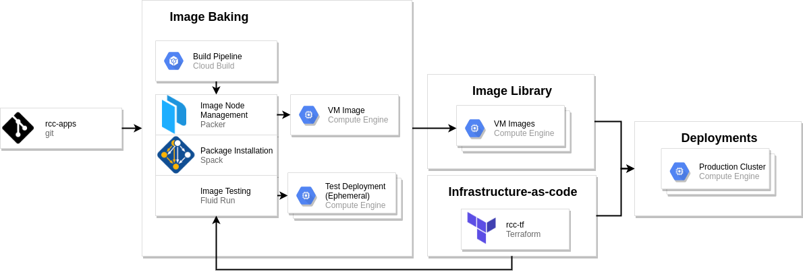

###########################
Image Bakery Architecture
###########################

The `RCC-Apps repository <https://github.com/fluidnumerics/rcc-apps>`_ is an "Image Bakery" repository; it provides the tooling necessary to create your own VM images to run a research computing cluster on Google Cloud. Additionally, there are a handful of builds defined for commonly used software packages in research computing to help you quickly get started. 

This documentation covers the general design principles for building VM images with the RCC-Apps repository, essentially describing an "Image Bakery". You should read this documentation if you plan on managing your own Image Bakery or you want to contribute packages to RCC-Apps.

==============================
Overview
==============================

The RCC-Apps repository is a version controlled repository of scripts that can be used to build VM images for Google Cloud. Specifically, RCC-Apps focuses on building VM images that are compatible with the `RCC solutions on Google Cloud <https://console.cloud.google.com/marketplace/browse?q=rcc>`_, which is a set of autoscaling RCC/HPC cluster solutions with a Slurm job scheduler.

The `RCC Architecture <https://research-computing-cluster.readthedocs.io/en/latest/Reference/architecture.html>`_ consists of a Slurm controller, login nodes, and an array of compute nodes that are sorted into compute partitions. With RCC-Apps, you can create VM images that can be used for your controller, login, and compute nodes. Given the flexibility of the RCC architecture, you can create VM images that are tuned for specific applications and align each VM imageswith specific compute partitions. This gives you the ability to have a single heterogeneous autoscaling compute cluster that is tuned for a variety of applications to run on Google Cloud.

Image Bakery
==============

When we refer to an "Image Bakery", we refer to a system that is able to produce VM images from a version controlled build pipeline that can be used for deploying production systems. 

The RCC-Apps Image Bakery uses Google Cloud Build,  `Packer <https://packer.io>`_, and `Spack <https://spack.io>`_ to define each application's build process. With Cloud Build we define a build pipeline for each application in a YAML dictionary. The primary step for building VM images on Google Cloud is a call to Packer, which manages and executes commands on an ephemeral "imaging VM" and snapshots the resulting disk on our behalf. To install research computing applications, we have preferred to use Spack, since this gives us the ability to install applications from source code and provides the opportunity to target specific hardware.

The goal of baking a virtual machine image with software pre-installed is to be able to deploy functioning software on cloud infrastructure. Because of this, we usually want to execute tests to verify the software was installed and is functioning to required standards (e.g. it performs optimally, it does not segfault, etc.). `Fluid-Run <https://fluid-run.readthedocs.io>`_ is a useful build step for Google Cloud Build that can deploy RCC cluster's with custom VM images and execute a sequence of user-defined tests.

When a VM image is successfully created and passes any required tests, it is posted to the Google Compute Engine VM images for your project. This collection of images is referred to as an "Image Library". This image library, when coupled with the `RCC-tf <https://github.com/fluidnumerics/rcc-tf>`_ Terraform modules allows you to reliably deploy autoscaling compute clusters with your preferred applications.

===================
Components
===================

Packer
========
To bake VM images there are two essential ingredients:

1. The image you want to start from
2. The installation script(s) to run on the starting image

With these two basic ingredients, you can boot a virtual machine on Google Cloud, run your installation scripts, and save the resulting image for later use. Packer provides the ability to define these options, and more, using a json or YAML dictionary. Because of this, every package in RCC-Apps has an associated :code:`packer.json` file that can be called upon during the build process.

Spack
=======
Most of the VM images created in RCC-Apps use the `Spack <https://spack.io>`_ package manager to install applications. For all of the packages, except for the :code:`rcc-centos`, :code:`rcc-debian`, and :code:`rcc-ubuntu` packages, we opt to use `Spack environments <https://spack.readthedocs.io/en/latest/environments.html>`_.

Spack environments allow you define the packages you want to install, preferred compilers to use to build your application, build options, and target architecture. The RCC-Apps :code:`common/` directory provides a script ( `spack-install.sh <https://github.com/FluidNumerics/rcc-apps/blob/main/common/spack-install.sh>`_ ) that manages installing spack, it's dependencies, any requested compiler, and the software packages stated in a spack environment file. Additionally, :code:`spack-install.sh` will define :code:`/etc/profile.d/z10_spack_environment.sh` to load the Spack environment upon logging into a VM deployed with the created image. This ensures that end-users will be able to find and use the expected packages upon deployment.
